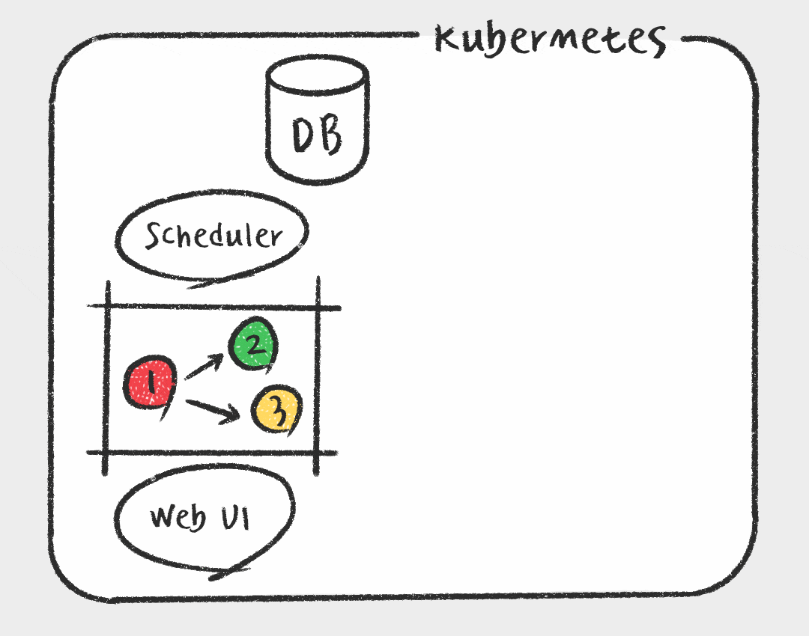

## Airflow Excutor에 관한 내용

### Kubernetes Executor
- k8s 에서 pod 형태로 Task 워커를 실행하는 방식
- 

### KubernetesPodOperator
- k8s에서 pod의 형태로 실행되는 operator
  - k8s executor 가 워커로 실행하는 이미지는 airflow 이미지
  - KubernetesPodOperator 가 실행하는 이미지는 사용자가 설정한 이미지
- 
