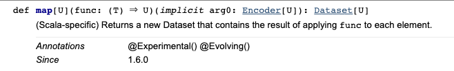

#### 21.1 암시적 변환이란
- 서로 다른 타입을 자동으로 변환
  - 여기서의 타입은 클래스도 포함
  - 서록를 고려하지 않고 구성된 두 소프트웨어를 병합하는데 유리
- 자바의 방식대로 구성하려면 구성해야할 사전 준비가 많음
  - 모든 클래스 재정의 필요
- 스칼라에서는 핵심 정보만 포함하고 동작하게 하고싶음

```scala
implicit def function2ActionListener(f: ActionEvent => Unit) =
   new ActionListener {
       def actionPerformed(event: ActionEvent) = f(event)
   }
// 요걸 작성해놓으면

button.addActionListener(
    (_: ActionEvent) => println("pressed!")
)
// 에서 자동으로 변환됨
```


#### 21.2 암시 규칙
- 암시적 정의: 컴파일러가 타입 오류를 고치기 이해 삽입할 수 있는 정의들
  - ex) x+y에 에러가 있다면 컴파일러가 convert(x)+y 시도
  - 여기서 convert는 사용 가능한 암시적 변환 중 하나

- 컴파일러가 암시적 변화는 처리하는 일반 규칙
  - 1. 표시규칙: implicit 으로 표시한 정의만 검토 대상이다
  - 2. scope 규칙: 삽입된 implicit 변환은 scope 내에서 단일 식별자로만 존재하거나, 반환의 결과나 원래 타입과 연관이 있어야된다
    - 단일식별자 규칙에서 예외: 원 타입 변환이나 반환 결과 타입의 동반 객체에 있는 암시적 정의도 살펴본다
  - 3. 한번에 하나만의 규칙: 오직 하나의 암시적 변환만 사용한다
  - 4. 명시적 우선 규칙: 코드가 그 상태로 타입 검사를 통과한다면 변환을 시도하지 않는다
  - 5. 암시적 변환 이름 붙이기: 명시적으로 유저가 사용할때 필요하다
- 암시가 쓰이는 부분
  - 1. 값을 컴파일러가 원하는 타입으로 변환
  - 2. 어떤 선택의 수신 객체를 변환
  - 3. 암시적 파라미터를 지정


#### 21.3 예상 타입으로의 암시적 변환
- 컴파일러가 Y타입이 필요한 위치에서 X타입을 봤다면 X를 Y로 변환하는 암시적 함수를 찾는다.
- 이때 intToDouble은 문제가 없지만, doubleToInt 처럼 정보가 손실되는 암시적 타입 변환은 사용하지 않는게 좋음


#### 21.4 호출 대상 객체 변환
- 메소드를 호출하는 대상이 되는 객체인 수신 객체에도 적용할 수 있음
- 용도
  - 1. 수신 객체 변환을 통해 새 클래스를 기존 클래스 계층 구조에 매끄럽게 통합 가능
    - ex) Int + Rational 은 에러가 나지만 IntToRational 을 만들어두면 자동으로 Rational + Rational로 면환 발생
  - 2. 언어 안에서 도메인 특화언어를 만드는 일을 지원
    - ex) 실제 Map(1 -> (1,2,3)) 형태의 -> 도 암시적 변환으로 구성된것
- 암시적 클래스
  - implicit 이 class 앞에 있는 클래스
  - 컴파일러가 클래스 생성자를 이용해서 암시적 클래스로 가는 암시적 변환을 만들어냄
```scala
case class Rectangle(width: Int, height: Int)

implicit class RectangleMaker(width: Int) {
    def x(height: Int) = Rectangle(width, height)
}

// 요렇게 해놓으면

val a = 3x4 // a에 Rectangle(3,4) 가 저장된다
```
    
    
------------------------------------------------


#### 21.5 암시적 파라미터
- 함수 인자 목록 자체도 암시적 변환 가능
  - 예시
    - someCall(a) => someCall(a)(b)
    - new someClass(a) => new SomeClass(a)(b)
  - 함수 호출시 빠진 파라미터를 자동으로 채워넣음
    - spark.implicit._ import 시 Dataframe.map의 인자에서 Encoder를 생략 가능한것이 이를 활용한것으로 보임



##### 컴파일러가 채워넣을 수 있는 인자
- 채워넣지 않은 마지막 파라미터 목록
  - someCall(a, b, c, d) 일때 someCall(a, b) => someCall(a, b, c, d) 처럼 뒤에 남은 값들을 자동으로 채워줌
  - 반드시 implicit 으로 c, d 에 대한 정의가 있어야 함
- 커링한 파라미터 목록
  - someCall(a)(b, c, d) 일때 someCall(a) => someCall(a)(b, c, d) 처럼 커링 목록을 자동으로 채워줌
  - 반드시 implicit 으로 (b, c, d)에 대한 정의가 있어야 함
- 양쪽 모두 someCall, someClass에서 암시적 변환 가능한 파라미터에 implicit 표시가 되어있어야 함
  - 위의 경우 a,b,c,d 전체에, 아래 경우 b,c,d에
  - 예제
    - 셸에 메시지를 출력하고 셸 프롬프트 문자열 ("$", ">" 등) 을 출력하는 클래스 예시
```scala
//// 기본 세팅
class PreferredPrompt(val preference: String)  // implicit으로 전달될 클래스 지정

object Greeter {
  def greet(name: String)(implicit prompt: PreferredPrompt) = {  // prompt에 implicit 표시
    println("Welcome, " + name + ". The system is ready.")
    println(prompt.preference)
  }
}


//// 명시적으로 지정하는 방법
val bobsPrompt = new PreferredPrompt("relax> ")

Greeter.greet("Bob")(bobsPrompt)
// ---------- 출력값 -----------
// Welcome, Bob. The system is ready.
// relax>


//// 암시적 제공 방법
object JoesPrefs {
  implicit val prompt = new PreferredPrompt("Yes, master> ")  // prompt 필드를 암시적으로 전달하겠다는 표현
}

import JoesPrefs._

Greeter.greet("Joe")
// ---------- 출력값 -----------
// Welcome, Joe. The system is ready.
// Yes, master>
```

- 여러 파라미터를 암시적으로 전달하려면 단순히 암시적 제공을 위한 object에 이를 추가하면 됨

```scala
class PreferredPrompt(val preference: String)  // implicit으로 전달될 클래스 Prompt 지정
class PreferredDrink(val preference: String)  // implicit으로 전달될 클래스 Drink 지정

object Greeter {
  def greet(name: String)(implicit prompt: PreferredPrompt, drink: PreferredDrink) = {
    println("Welcome, " + name + ". The system is ready.")
    print("But while you works, ")
    println("why not enjoy a cup of " + drink.preference + "?")
    println(prompt.preference)
  }
}


object JoesPrefs {
  implicit val prompt = new PreferredPrompt("Yes, master> ")
  implicit val drink = new PreferredPrompt("tea")
}


import JoesPrefs._


Greeter.greet("Joe")(prompt, drink)  // import 된 인자를 명시적으로도 전달가능
// ---------- 출력값 -----------
// Welcome, Joe. The system is ready.
// But while you works, why not enjoy a cup of tea?
// Yes, master>

Greeter.greet("Joe")
// ---------- 출력값 -----------
// Welcome, Joe. The system is ready.
// But while you works, why not enjoy a cup of tea?
// Yes, master>
```

##### 암시적 파라미터가 주로 사용되는 경우
  - 암시적 파라미터 앞 명시적 파라미터에 대한 정보 제공
    - Haskell의 타입클래스와 유사
  - 예시
```scala
// 명시적인 형태의 함수 - elements 라는 리스트와 비교를 위한 클래스 ordering을 입력받아서 가장 큰 원소 리턴
def maxListOrdering[T](elements: List[T])(ordering: Ordering[T]): T = elements.match {
  case List() => throw new IllegalArgumentException("empty list!")   // 리스트가 비어있으면 에러
  case List(x) => x    // 리스트에 원소가 1개면 해당 값 리턴
  case x :: rest =>    // 리스트에 원소가 여러개면
    val maxRes = maxListOrdering(rest)(ordering)  // 맨 앞이외에 나머지 값에 대해 재귀 수행
    if(ordering.gt(x, maxRest)) x                 // 재귀 결과와 맨 앞값을 비교해서 큰 값 리턴
    else maxRest
}

// 암시적 파라미터를 사용한 동일한 함수 - Ordering[T]에 대한 암시적 정의가 있다면 사용
def maxListOrderingImp[T](elements: List[T])(implicit ordering: Ordering[T]): T = elements.match {
  case List() => throw new IllegalArgumentException("empty list!")   // 리스트가 비어있으면 에러
  case List(x) => x    // 리스트에 원소가 1개면 해당 값 리턴
  case x :: rest =>    // 리스트에 원소가 여러개면
    val maxRes = maxListOrderingImp(rest)(ordering)  // 맨 앞이외에 나머지 값에 대해 재귀 수행
    if(ordering.gt(x, maxRest)) x                 // 재귀 결과와 맨 앞값을 비교해서 큰 값 리턴
    else maxRest
}

// 실제 스칼라 기본 라이브러리에 기본 자료형에 대한 Ordering[T] 정의되어있음
maxListOrderingImplicit(List(1, 5, 10, 3)) // 10 - 자동으로 Ordering[Int] 찾아 씀
maxListOrderingImplicit(List(1.5, 5.2, 10.7, 3.141592)) // 10.7 - 자동으로 Ordering[Double] 찾아 씀
maxListOrderingImplicit(List("one", "two", "three")) // "two" - 자동으로 Ordering[String] 찾아 씀
```

##### 암시적 파라미터에 대한 스타일 규칙
- 일반적이지 않은 특별한 이름의 타입을 사용해야 함
  - 위의 maxListOrderingImplicit 에서 ordering을 함수 대신 객체로 감싼것도 그런 이유
- 안좋은 예시
```scala
def maxListPoorStyle[T](elements: List[T])(implicit orderer(T, T) => Boolean): T
```
  - 아무 타입의 파라미터 2개를 boolean으로 바꾸는 모든 함수에 해당될 수 있음


#### 21.6 맥락 바운드
- 파라미터에 implicit을 사용할 경우 함수 내에서도 이를 다시 암시적 값으로 사용
```scala
def maxListOrderingImp2[T](elements: List[T])(implicit ordering: Ordering[T]): T = elements.match {
  case List() => throw new IllegalArgumentException("empty list!")
  case List(x) => x 
  case x :: rest => 
    val maxRes = maxListOrderingImp2(rest)        // 여기서도 뒤에 ordering 생략해버릴 수 있음
    if(ordering.gt(x, maxRest)) x
    else maxRest
}
```

- 거기다가 ordering이란 이름 대신 "암시적으로 들어올 무언가" 라는 형태로도 표현 가능
  - implicitly이용
    - 표준 라이브러리에 존재
    - def implicitly[T](implicit t: T) = t
    - 암시적으로 들어올 타입 T인 "무언가"를 리턴
```scala
def maxListOrderingImp3[T](elements: List[T])(implicit ordering: Ordering[T]): T = elements.match {
  case List() => throw new IllegalArgumentException("empty list!")
  case List(x) => x 
  case x :: rest => 
    val maxRes = maxListOrderingImp3(rest)
    if(implicitly[Ordering[T]].gt(x, maxRest)) x        // 암시적으로 들어올 Ordering[T] 타입의 "무언가"를 사용
    else maxRest
}
```

- 여기까지 오면 ordering이란 이름 필요없음
```scala
def maxListOrderingImp4[T](elements: List[T])(implicit anyThing: Ordering[T]): T = elements.match {
  case List() => throw new IllegalArgumentException("empty list!")
  case List(x) => x 
  case x :: rest => 
    val maxRes = maxListOrderingImp4(rest)
    if(implicitly[Ordering[T]].gt(x, maxRest)) x
    else maxRest
}
```

- 아예 생략해버리고 그냥 implicit으로 이런 타입 들어올거니깐 허용해줘라 만 알려주자
  - 요게 맥락 바운드 이다
```scala
def maxListOrderingImp5[T : Ordering](elements: List[T]): T = elements.match { // Ordering이라는 타입이 들어올거니깐 너그럽게 봐줘라
  case List() => throw new IllegalArgumentException("empty list!")
  case List(x) => x 
  case x :: rest => 
    val maxRes = maxListOrderingImp5(rest)
    if(implicitly[Ordering[T]].gt(x, maxRest)) x
    else maxRest
}
```


#### 21.7 여러 변환을 사용하는 경우
- 적용 가능한 함시적 변환이 스코프 안에 여러개 있을 경우
  - 기본적으로 스칼라는 변환을 수행하지 않음 (scala 2.7까지)
  - 단 특정한 경우에는 변환 가능 (scala 2.8부터)
- 여러 변환이 중첩될때 선택하는 기준
  - 변환중 하나가 다른 하나보다 더 구체적이라면 구체적인 것 선택
    - 전자의 인자 타입이 후자의 서브타입이다
    - 두 변환 모두 메소드인데, 전자를 둘러싼 클래스가 후자를 둘러싼 클래스의 서브셋이다
  - 대략적으론 알겠는데 실제 적용을 모르겠음
- 바꾼 원인은 문자열에서의 문제
```
val cba = "abc".reverse   // cba는 스칼라 컬렉션이 됨 - 컬렉션과 스트링의 implicit reverse를 모두 만들지 않았기 때문에 생긴 문제
val res = ("abc" == "abc".reverse.reverse) // res가 false 였음!
```


#### 21.8 암시 디버깅
- 암시를 컴파일러가 찾지 못할때 사용할 수 있는 방법: 명시적으로 변환 함수를 넣어본다
- 컴파일러가 암시적 변환을 어떤 함수로 수행하는지 알고싶을 경우: 컴파일러에 -Xprint:typer 옵션을 준다


#### 21.9 결론
- 암시적 변환은 코드 단축을 위한 강력한 기능
- 경고
  - 암시를 너무 자주 사용하면 코드 이해 어려움
  - 암시 추가전 최대한 상속, 믹스인, 오버로드 등을 이용해서 대체할 방법을 찾아볼것


